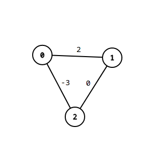

# Generikus vector és kupac, alkalmazva rendezésre és dijkstra algoritmusra

## Alapvető célok

A feladat egyik célja, hogy generikus vectort valósítjunk meg, azaz egy olyan adatszerkezetet, ami változó méretű adatot képes indexeléssel tárolni.

Másik cél egy bináris heap készítése, ami az előbbi adatszerkezetre építve valósítja meg működését. Feladata, hogy mindig a benne lévő legkisebb prioritású elemet tudja biztosítani hatékonyan. (Ezt a prioritást az adott adattípus < operátora határozza meg.)

Az adatstruktúrák megvalósítása operátorokban gazdag kell legyen, hiszen alapvető, gyakran használt struktúrákról beszélünk.

## Felhasználás

Ezek felhasználásának bemutatására két, egyben generikus és konkrét példát tervezek megvalósítani:

1. Egy hatékony rendező algoritmus
1. Dijkstra algoritmus

Mindkettő egyszerre igényli a két adatszerkezetet, így egy jó példa lehet, az adatszerkezet fontosságára, hatékonyságára és tesztelésére.

Dijksta algoritmus esetében szintén fontos, hogy későbbi fejlesztésben felül lehessen definiálni a beolvasást, hogy támogasson más formátumokat.

# UML


Az UML-t módosítottam, mivel ellentétben azzal, ahogy tervezéskor gondoltam nincs értelme protectedbe rakni a tagokat.

# Algoritmusok

## Vector

- pushBack

  > A működés lényege, hogy a lefoglalt terület nem egyezik meg a tárolt adatokkal. Ez azért kell, hogy ne kelljen minden beszúrásnál újrafoglalni területet és másolni. A lefoglalt területet `capacity`-nek nevezem. Ez mindig kettő hatvány lesz, így ha nem lenne elég a capacity a beszúrandó elemnek, akkor megduplázom azt.

- popBack
  > Hasonló a pushBack lényegéhez, azonban itt meg azt nem akarjuk, hogy ha pont egy másik kettő hatvány szakaszba esik át, akkor azonnal csökkentsük a capacityt, mivel gyakran ezután szúrúnk be adatot, fölöslegessé téve a csökkentést. Így azt a módszert választottam, hogy ha már 2-vel alatta lévő 2 hatvány szakaszba esik `capacity == 4 * _length`, akkor dönt úgy hogy csökkenti a területét.

> A többi függvény nem tartalmaz új algoritmust, hanem inkább a meglévő szintén egyszerű függvényekre támaszkodik, ami bár nem a legeffektívebb, de sokkal nagyobb hibamentességet és átláhatóságot garantál.

## BinaryHeap

> Az adatstrúktúra egy Vector-t használ fel, hogy egy bináris fát tároljon. Az algoritmusok teljes egészében megegyeznek a közismert algoritmusokkal.

- insert
  > Az adatot beszúrjuk a vector végére, ezzel garantálva, hogy levél legyen, és hogy a kiegyensúlyozott bináris fa tulajdonságot fenntartsuk. Ezután felfele buborékoztatjuk a fán, amíg a szülője nagyobb nála. Valójában csak a szűlőket mozgatjuk lefele a megfelelő helyekre és amikor a ciklus véget ér, akkor szúrjuk be az elemet.
- pop
  > Ilyenkor a legfelső elemet kivesszük, hiszen ez a legkisebb elem. Ezután a két gyerek közül a kisebbet felülre buborékoztatjuk, hiszen ez a másik ág minden eleménél is kisebb lesz. Ezt folytatjuk az üres helyeken, amíg van gyerek, hiszen addig sérül a gráf tulajdonság.

## Dijkstra

> Az adatstruktúra Vector-t használ fel a gráf tárolásához, és a legrövidebb út meghatározásához pedig BinaryHeap-et. Az algoritmusok teljes egészében megegyeznek a közismert algoritmusokkal.

- read

  > A megadott fájlból beolvassuk a gráfot a `graph` szomszédsági listába. A fájl először a csúcsok számával kezdődik, majd n sorban először a fokszám található, m, majd m csúcs amihez vezet él.

- solve

  > Először berakunk a heapbe egy álélet, amit a kezdőd csúcsba mutat 0 távval és a -1-es nem létezú forrás csúccsal. Ezután minden iterációban kivesszük a legközelebb lévő elemet a kezdődcsúcstól nézve, lementjük annak távolsáságát, illetve hogy melyik már ismert távú csúcsból jutott el ide. Végül berakjuk azon szomszédjait, melyek távja még nem ismert. Ez alatt azt értjük, hogy egy élet rakunk a heapbe, ami megegyezik a szomédba mutató éllel, a súly kivételével, ugyanis annak a jelenlegi csúcsba való táv + él súlya súlllyal kell megegyeznie. Teljes indukcióval belátható, hogy az algoritmus helyes, ha a súlyok összeg függvénye monoton növekszik. Ezt a feltételt természetesen ellenőrzi az algoritmus

- printPath
  > Ez egy preorder rekurzív algoritmus. Először megtudjuk az utat a szülőig, majd kiírjuk a jelenlegi csúcsot. Bázis lesz a kezdő csúcs. A formátum: "(út hossza): csúcs1 csúcs2 ...", ahol a csúcs felsorolás egy szimpla "-" ha nem vezet oda út. Az utóbbi a `parent` és `weights` tömbökben, amit a csúcsindexszel lehet indexelni, úgy mutatkozik meg, hogy -1 szerepel az adott helyen.

# Tesztek

- sort
  > Ez a fájl 100 darab egyedi számot tartalmaz 1 és 100 között. A Sort függvénynek a várt kimenete 1-től 100-ig a számok növekvő sorrendben.
- graph
  > Ez egy random gráf, aminek a várt kimenete:
  ```
  (0): 0
  (4): 0 1
  (12): 0 1 2
  (19): 0 1 2 3
  (21): 0 7 6 5 4
  (11): 0 7 6 5
  (9): 0 7 6
  (8): 0 7
  (14): 0 1 2 8
  ```
- graphFloat
  > Az előző gráffal egyezik, viszont a súlyok kiegészültek tizedes résszel. Várt kimenet:
  ```
  	(0): 0
  	(4.1): 0 1
  	(13): 0 1 2
  	(20.5): 0 1 2 3
  	(23.48): 0 7 6 5 4
  	(12.6): 0 7 6 5
  	(9.9): 0 7 6
  	(8.2): 0 7
  	(15.1): 0 1 2 8
  ```
- graphMalformed

  > A gráfban van negatív kör, így ennek a következménye, hogy az összegfüggvény nem monoton.

  

# Dokumentáció

## Vector

```c++
/// Allocated memory's size
int capacity;

/// _length is the number of used elements in `data`
int _length;

/// T[capacity]
T *data = nullptr;

/// @brief Changes `data`-s *allocated* size
/// @param capacityNew `data`'s new *allocated* size
/// @exception std::bad_alloc if capacityNew < length
void reallocate(int capacityNew);

/// @brief Deep copies `vector`
/// @param vector vector to be copied
void copy(Vector<T> const &vector);

public:

/// @brief Returns the number of stored data
virtual int length() const;

/// @brief Clears then fills with `value`
/// @param size number of elements to insert
/// @param value value to be inserted
virtual void resize(int size, T const &value);

/// @brief Deletes data, then recreates it with `capacity` = 1
virtual void clear();

/// @brief data[length] = value. Capacity is doubled if full
/// @param size number of elements to insert
/// @param value value to be inserted
virtual void pushBack(T const &value);

/// @brief Marks last element as garbage. Decreases capacity if needed
/// @param size number of elements to insert
/// @param value value to be inserted
/// @return last element
virtual T popBack();

//operator=
virtual Vector<T> &operator=(Vector<T> const &vector);
virtual Vector<T> &operator=(std::initializer_list<T> const &values);

/// @brief operator[]
/// @exception std::out_of_range
virtual T &operator[](int index);
/// @brief operator[] const
/// @exception std::out_of_range
virtual T const &operator[](int index) const;

/// @brief Creates a new Vector with item appended to the end of it
virtual Vector<T> operator+(T const &value) const;
/// @brief Creates a new Vector with the Vector appended to the end of the Vector
virtual Vector<T> operator+(Vector<T> const &vector) const;

/// @brief Appends item to the end of the Vector
virtual Vector<T> &operator+=(T const &value);
/// @brief Appends Vector to the end of the Vector
virtual Vector<T> &operator+=(Vector<T> const &vector);

//ctor, dtor
Vector() : data(nullptr);
Vector(int size, T def) : data(nullptr);
virtual ~Vector();

//copy ctor
Vector(Vector<T> const &vector) : data(nullptr);

//init list ctor
Vector(std::initializer_list<T> const &values) : data(nullptr);

//unit test
static void Test();

"friends":
template <typename T>
Vector<T> operator+(T const &value, Vector<T> const &vector);

/// @brief Format: [size] (elemen1, ...)
template <typename T>
std::ostream &operator<<(std::ostream &stream, Vector<T> const &vector);
```

## BinaryHeap

```c++
Container::Vector<T> data;

private:

/// @brief Parent's index if exists
/// @param index Parent's index
int parentIndex(int index) const;
/// @brief Left child's index if exists
/// @param index Left child's index
int childLeftIndex(int index) const;
/// @brief Right child's index if exists
/// @param index Right child's index
int childRightIndex(int index) const;

/// @brief Parent's value
/// @param index Parent's data
/// @exception std::out_of_range
T &parent(int index);
/// @brief Left child's value
/// @param index Left child's data
/// @exception std::out_of_range
T &childLeft(int index);
/// @brief Right child's value
/// @param index Right child node's data
/// @exception std::out_of_range
T &childRight(int index);

/// @brief Child's index with lesser value
/// @param index Node's index whose child we want
/// @return -1 if lead node
int minChildIndex(int index);
/// @brief Child with lesser value
/// @param index Node's index whose child we want
/// @exception std::out_of_range
T &minChild(int index);

public:

/// @brief Clears heap
virtual void clear();

/// @brief Inserts value into heap
/// @param value Value to be inserted
virtual void insert(T const &value);

/// @brief Inserts Container::Vector of values into heap
/// @param values Container::Vector of values to be inserted
virtual void insert(Container::Vector<T> const &values);

/// @brief Peek the lowest element
/// @return Lowest element
/// @exception std::out_of_range if empty
virtual T top() const;

/// @brief Remove the lowest element
/// @return Lowest element
/// @exception std::out_of_range if empty
virtual T pop();

/// @brief Is heap empty
virtual bool empty() const;

/// @brief Number of element in heap
virtual int length() const;

/// @brief Sorts the given vector
/// @param vector vector to be sorted
static void Sort(Container::Vector<T> &vector);

//ctor
BinaryHeap();
BinaryHeap(Container::Vector<T> const &vector);

//dtor
virtual ~BinaryHeap();

/// @brief Creates a new BinaryHeap with item added to it
virtual BinaryHeap<T> operator+(T const &value);
/// @brief Creates a new BinaryHeap with the Vector's items added to the BinaryHeap
virtual BinaryHeap<T> operator+(Container::Vector<T> const &values);

/// @brief Adds item to the BinaryHeap
virtual BinaryHeap<T> &operator+=(T const &value);
/// @brief Adds Vector's items to the BinaryHeap
virtual BinaryHeap<T> &operator+=(Container::Vector<T> const &values);

//unit test
static void Test();

"friends":
template <typename T>
BinaryHeap<T> operator+(T const &value, BinaryHeap<T> const &binaryHeap);

template <typename T>
BinaryHeap<T> operator+(Container::Vector<T> const &values, BinaryHeap<T> const &binaryHeap);
```

## Dijkstra

```c++
struct Edge {
	int from;
	int to;
	Weight weight;
	bool operator<(Edge other) const {
		return weight < other.weight;
	}
};

Container::Vector<Container::Vector<Edge>> graph;

/// @brief Helper function for `printPath`
virtual void printPathRec(int to);

/// @brief Read file into `graph`
/// @exception std::ios_base::failure
virtual void read(char const *filename);

/// @brief Calculates all the shortest paths from `startIndex`
/// @exception std::invalid_argument if sum of weights along a path don't form a monotonic function
void solve();

/// Node's index from which the shortest paths are known
int startIndex;

public:

/// @brief Number of nodes
int length() const;

/// Each node's parent index in the route-tree from `startIndex` to i
Container::Vector<int> parents;

/// Each node's weight in the route-tree from `startIndex` to i
Container::Vector<Weight> weights;

/// @brief Prints path from `startIndex` to `to`
/// @exception std::out_of_range
virtual void printPath(int to);

//ctor
/// @brief Reads then solves. First line should be the number of nodes.
/// each i-th line after that should first contain the number of edges from that node
/// and after that (edge's end, edge's weight) pairs all separated by whitespace.
/// @exception std::ios_base::failure if file not found or if file is malformed
/// @exception std::invalid_argument if sum of weights along a path don't form a monotonic function
Dijkstra(char const *filename, int startIndex);
```
