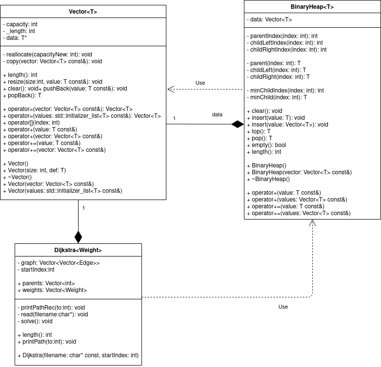

# Generikus vector és kupac, alkalmazva rendezésre és dijkstra algoritmusra

Szerkezetek rendelkeznek virtuális függvényekkel a származtatás érdekében. Ezeket `V`-vel jelölöm.

Vector<T>

- `int` length() `V`
- resize(size, defaultValue) `V`
- clear() `V`
- pushBack(T) `V`
- `T` popBack() `V`
- operator=(Vector<T>) `V`
- operator=({}) `V`
- operator[] `V`
- operator+(T) `V`
- operator+(Vector<T>) `V`
- operator+=(T) `V`
- operator+=(Vector<T>) `V`
- Vector()
- Vector(size, defaultValue)
- Vector(Vector<T>)
- Vector({})
- `static` Test()
- kívül
  - operator+(T, Vector<T>)
  - operator<<
    - formátum: "[méret](1.elem, 2.elem, ...)"

BinaryHeap<T>

- clear() `V`
- insert(T) `V`
- insert(Vector<T>) `V`
- T top() `V`
- T pop() `V`
- bool empty() `V`
- int length() `V`
- BinaryHeap()
- BinaryHeap(Vector<T>)
- operator+(T) `V`
- operator+(Vector<T>) `V`
- opartor+=(T) `V`
- opartor+=(Vector<T>) `V`
- static Sort(Vector<T>)
- static Test()
- kívül
  - operator(T, BinaryHeap<T>)
  - operator(Vector<T>, BinaryHeap<T>)

Dijkstra<Weight>

- int length()
- Vector<int> parents
- Vector<Weight> weights
- printPath(int to) `V`
- Dijkstra(filename, startIndex)

Dijkstra esetében a rejtett `read(filename)` és `printPathRec(int to)` is virtuális a bővíthetőség érdekében.

Az egyes adatszerkezetek ha tartalmaznak `static Test()`-et, akkor annak célja, hogy változatos eseteket, funkcionalitásokat kipróbáljanak és assert-tel leteszteljék azokat.

Ezekhez a szerkezetekhez Exception is tartozik, melyeket az őket tartalmazó namespacebe helyezek (kivétel Dijkstra...), hogy más megegyező funkcionalitású adatszerkezetek is felhasználhassák ezeket.

Feladat szintén egy pl egész számokat tartalmazó fájlt vektorba beolvasni, majd BinaryHeap-pel sortolva kiírni a beépített `operator<<`-ral.
Szintén kell egy a Dijkstrát kipróbáló rész, ahol az egyik esetben beolvassa a fájlt (két különböző súlytípusú példa kell), majd kiírja a legrövidebb utakat az összes csúcsba, míg másik esetben detektálja, hogy nem alkalmazható az algoritmus.

# UML



# Algoritmusok

## Vector

- pushBack

  > A működés lényege, hogy a lefoglalt terület nem egyezik meg a tárolt adatokkal. Ez azért kell, hogy ne kelljen minden beszúrásnál újrafoglalni területet és másolni. A lefoglalt területet `capacity`-nek nevezem. Ez mindig kettő hatvány lesz, így ha nem lenne elég a capacity a beszúrandó elemnek, akkor megduplázom azt.

- popBack
  > Hasonló a pushBack lényegéhez, azonban itt meg azt nem akarjuk, hogy ha pont egy másik kettő hatvány szakaszba esik át, akkor azonnal csökkentsük a capacityt, mivel gyakran ezután szúrúnk be adatot, fölöslegessé téve a csökkentést. Így azt a módszert választottam, hogy ha már 2-vel alatta lévő 2 hatvány szakaszba esik `capacity == 4 * _length`, akkor dönt úgy hogy csökkenti a területét.

> A többi függvény nem tartalmaz új algoritmust, hanem inkább a meglévő szintén egyszerű függvényekre támaszkodik, ami bár nem a legeffektívebb, de sokkal nagyobb hibamentességet és átláhatóságot garantál.

## BinaryHeap

> Az adatstrúktúra egy Vector-t használ fel, hogy egy bináris fát tároljon. Az algoritmusok teljes egészében megegyeznek a közismert algoritmusokkal.

- insert
  > Az adatot beszúrjuk a vector végére, ezzel garantálva, hogy levél legyen, és hogy a kiegyensúlyozott bináris fa tulajdonságot fenntartsuk. Ezután felfele buborékoztatjuk a fán, amíg a szülője nagyobb nála. Valójában csak a szűlőket mozgatjuk lefele a megfelelő helyekre és amikor a ciklus véget ér, akkor szúrjuk be az elemet.
- pop
  > Ilyenkor a legfelső elemet kivesszük, hiszen ez a legkisebb elem. Ezután a két gyerek közül a kisebbet felülre buborékoztatjuk, hiszen ez a másik ág minden eleménél is kisebb lesz. Ezt folytatjuk az üres helyeken, amíg van gyerek, hiszen addig sérül a gráf tulajdonság.

## Dijkstra

> Az adatstruktúra Vector-t használ fel a gráf tárolásához, és a legrövidebb út meghatározásához pedig BinaryHeap-et. Az algoritmusok teljes egészében megegyeznek a közismert algoritmusokkal.

- read

  > A megadott fájlból beolvassuk a gráfot a `graph` szomszédsági listába. A fájl először a csúcsok számával kezdődik, majd n sorban először a fokszám található, m, majd m csúcs amihez vezet él.

- solve

  > Először berakunk a heapbe egy álélet, amit a kezdőd csúcsba mutat 0 távval és a -1-es nem létezú forrás csúccsal. Ezután minden iterációban kivesszük a legközelebb lévő elemet a kezdődcsúcstól nézve, lementjük annak távolsáságát, illetve hogy melyik már ismert távú csúcsból jutott el ide. Végül berakjuk azon szomszédjait, melyek távja még nem ismert. Ez alatt azt értjük, hogy egy élet rakunk a heapbe, ami megegyezik a szomédba mutató éllel, a súly kivételével, ugyanis annak a jelenlegi csúcsba való táv + él súlya súlllyal kell megegyeznie. Teljes indukcióval belátható, hogy az algoritmus helyes, ha a súlyok összeg függvénye monoton növekszik. Ezt a feltételt természetesen ellenőrzi az algoritmus

- printPath
  > Ez egy preorder rekurzív algoritmus. Először megtudjuk az utat a szülőig, majd kiírjuk a jelenlegi csúcsot. Bázis lesz a kezdő csúcs. A formátum: "(út hossza): csúcs1 csúcs2 ...", ahol a csúcs felsorolás egy szimpla "-" ha nem vezet oda út. Az utóbbi a `parent` és `weights` tömbökben, amit a csúcsindexszel lehet indexelni, úgy mutatkozik meg, hogy -1 szerepel az adott helyen.

# Tesztek

- sort
  > Ez a fájl 100 darab egyedi számot tartalmaz 1 és 100 között. A Sort függvénynek a várt kimenete 1-től 100-ig a számok növekvő sorrendben.
- graph
  > Ez egy random gráf, aminek a várt kimenete:
  ```
  (0): 0
  (4): 0 1
  (12): 0 1 2
  (19): 0 1 2 3
  (21): 0 7 6 5 4
  (11): 0 7 6 5
  (9): 0 7 6
  (8): 0 7
  (14): 0 1 2 8
  ```
- graphFloat
  > Az előző gráffal egyezik, viszont a súlyok kiegészültek tizedes résszel. Várt kimenet:
  ```
  	(0): 0
  	(4.1): 0 1
  	(13): 0 1 2
  	(20.5): 0 1 2 3
  	(23.48): 0 7 6 5 4
  	(12.6): 0 7 6 5
  	(9.9): 0 7 6
  	(8.2): 0 7
  	(15.1): 0 1 2 8
  ```
- graphMalformed

  > A gráfban van negatív kör, így ennek a következménye, hogy az összegfüggvény nem monoton.

  

# Dokumentáció

## Vector

```c++
/// Allocated memory's size
int capacity;

/// _length is the number of used elements in `data`
int _length;

/// T[capacity]
T *data = nullptr;

/// @brief Changes `data`-s _allocated_ size
/// @param capacityNew `data`'s new _allocated_ size
/// @exception Container::ExceptionDataLoose capacityNew < length
void reallocate(int capacityNew);

/// @brief Deep copies `vector`
/// @param vector vector to be copied
void copy(Vector<T> const &vector);

/// @brief Returns the number of stored data
virtual int length() const;

/// @brief Clears then fills with `value`
/// @param size number of elements to insert
/// @param value value to be inserted
virtual void resize(int size, T const &value);

/// @brief Deletes data, then recreates it with `capacity` = 1
virtual void clear();

/// @brief data[length] = value. Capacity is doubled if full
/// @param size number of elements to insert
/// @param value value to be inserted
virtual void pushBack(T const &value);

/// @brief Marks last element as garbage. Decreases capacity if needed
/// @param size number of elements to insert
/// @param value value to be inserted
/// @return last element
virtual T popBack();

//operator=
virtual Vector<T> &operator=(Vector<T> const &vector);
virtual Vector<T> &operator=(std::initializer_list<T> const &values);

//operator[]
virtual T &operator[](int index) const;

//operator+
virtual Vector<T> operator+(T const &value) const;
virtual Vector<T> operator+(Vector<T> const &vector) const;

//operator+=
virtual Vector<T> &operator+=(T const &value);
virtual Vector<T> &operator+=(Vector<T> const &vector);

//ctor, dtor
Vector();
Vector(int size, T def);
virtual ~Vector();

//copy ctor
Vector(Vector<T> const &vector);

//init list ctor
Vector(std::initializer_list<T> const &values);

//unit test
static void Test();
```

## BinaryHeap

```c++
/// @brief Parent's index in data if exists
/// @param index Node's index whose parent we want
int parentIndex(int index) const;
/// @brief Left child's index in data if exists
/// @param index Node's index whose child we want
int childLeftIndex(int index) const;
/// @brief Right child's index in data if exists
/// @param index Node's index whose child we want
int childRightIndex(int index) const;

/// @brief Parent's value in data
/// @param index Node's index whose parent we want
/// @exception Heap::ExceptionIndexOutofbounds
T &parent(int index) const;
/// @brief Left child's value in data
/// @param index Node's index whose child we want
/// @exception Heap::ExceptionIndexOutofbounds
T &childLeft(int index) const;
/// @brief Right child's value in data
/// @param index Node's index whose child we want
/// @exception Heap::ExceptionIndexOutofbounds
T &childRight(int index) const;

/// @brief Child's index with lesser value
/// @param index Node's index whose child we want
/// @return -1 if lead node
int minChildIndex(int index) const;
/// @brief Child with lesser value
/// @param index Node's index whose child we want
/// @exception Heap::ExceptionIndexOutofbounds
T &minChild(int index) const;

/// @brief Clears heap
virtual void clear();

/// @brief Inserts value into heap
/// @param value Value to be inserted
virtual void insert(T const &value);

/// @brief Inserts Container::Vector of values into heap
/// @param values Container::Vector of values to be inserted
virtual void insert(Container::Vector<T> const &values);

/// @brief Peek the lowest element
/// @return Lowest element
/// @exception Heap::ExceptionEmpty
virtual T top() const;

/// @brief Remove the lowest element
/// @return Lowest element
/// @exception Heap::ExceptionEmpty
virtual T pop();

/// @brief Is heap empty
virtual bool empty() const;

/// @brief Number of element in heap
virtual int length() const;

/// @brief Sorts the given vector
/// @param vector vector to be sorted
static void Sort(Container::Vector<T> const &vector);

//ctor
BinaryHeap();
BinaryHeap(Container::Vector<T> const &vector);

//dtor
virtual ~BinaryHeap();

//operator+
virtual BinaryHeap<T> operator+(T const &value);
virtual BinaryHeap<T> operator+(Container::Vector<T> const &values);

//operator+=
virtual BinaryHeap<T> &operator+=(T const &value);
virtual BinaryHeap<T> &operator+=(Container::Vector<T> const &values);

//unit test
static void Test();
```

## Dijkstra

```c++
/// @brief Helper function for `printPath`
virtual void printPathRec(int to);

/// @brief Read file into `graph`
/// @exception Dijkstra::ExceptionFileNotexist
virtual void read(char const *filename);

/// @brief Calculates all the shortest paths from `startIndex`
void solve();

/// Node's index from which the shortest paths are known
int startIndex;

/// @brief Number of nodes
int length() const;

/// Each node's parent index in the route-tree from `startIndex` to i
Container::Vector<int> parents;

/// Each node's weight in the route-tree from `startIndex` to i
Container::Vector<Weight> weights;

/// @brief Prints path from `startIndex` to `to`
/// @exception Dijkstra::ExceptionOutofbounds
virtual void printPath(int to);

//ctor
/// @brief Reads then solves. First line should be the number of nodes.
/// each i-th line after that should first contain the number of edges from that node
/// and after that (edge's end, edge's weight) pairs all separated by whitespace.
Dijkstra(char const *filename, int startIndex);
```
