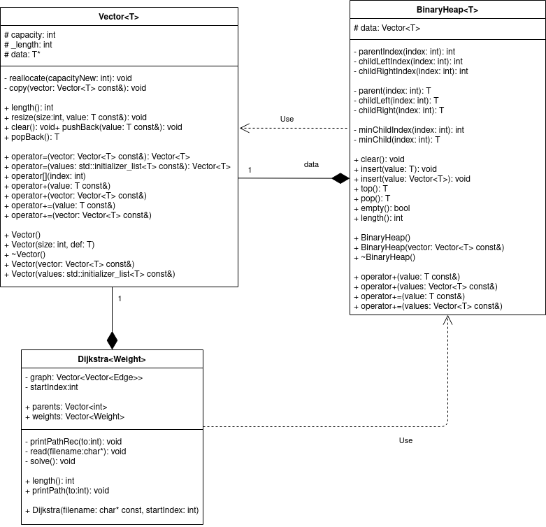

# Generikus vector és kupac, alkalmazva rendezésre és dijkstra algoritmusra

## Alapvető célok

A feladat egyik célja, hogy generikus vectort valósítjunk meg, azaz egy olyan adatszerkezetet, ami változó méretű adatot képes indexeléssel tárolni.

Másik cél egy bináris heap készítése, ami az előbbi adatszerkezetre építve valósítja meg működését. Feladata, hogy mindig a benne lévő legkisebb prioritású elemet tudja biztosítani hatékonyan. (Ezt a prioritást az adott adattípus < operátora határozza meg.)

Az adatstruktúrák megvalósítása operátorokban gazdag kell legyen, hiszen alapvető, gyakran használt struktúrákról beszélünk.

## Felhasználás

Ezek felhasználásának bemutatására két, egyben generikus és konkrét példát tervezek megvalósítani:

1. Egy hatékony rendező algoritmus
1. Dijkstra algoritmus

Mindkettő egyszerre igényli a két adatszerkezetet, így egy jó példa lehet, az adatszerkezet fontosságára, hatékonyságára és tesztelésére.

Dijksta algoritmus esetében szintén fontos, hogy későbbi fejlesztésben felül lehessen definiálni a beolvasást, hogy támogasson más formátumokat.

# UML

# Algoritmusok

## Vector

- pushBack

  > A működés lényege, hogy a lefoglalt terület nem egyezik meg a tárolt adatokkal. Ez azért kell, hogy ne kelljen minden beszúrásnál újrafoglalni területet és másolni. A lefoglalt területet `capacity`-nek nevezem. Ez mindig kettő hatvány lesz, így ha nem lenne elég a capacity a beszúrandó elemnek, akkor megduplázom azt.

- popBack
  > Hasonló a pushBack lényegéhez, azonban itt meg azt nem akarjuk, hogy ha pont egy másik kettő hatvány szakaszba esik át, akkor azonnal csökkentsük a capacityt, mivel gyakran ezután szúrúnk be adatot, fölöslegessé téve a csökkentést. Így azt a módszert választottam, hogy ha már 2-vel alatta lévő 2 hatvány szakaszba esik `capacity == 4 * _length`, akkor dönt úgy hogy csökkenti a területét.

> A többi függvény nem tartalmaz új algoritmust, hanem inkább a meglévő szintén egyszerű függvényekre támaszkodik, ami bár nem a legeffektívebb, de sokkal nagyobb hibamentességet és átláhatóságot garantál.

## BinaryHeap

> Az adatstrúktúra egy Vector-t használ fel, hogy egy bináris fát tároljon. Az algoritmusok teljes egészében megegyeznek a közismert algoritmusokkal.

- insert
  > Az adatot beszúrjuk a vector végére, ezzel garantálva, hogy levél legyen, és hogy a kiegyensúlyozott bináris fa tulajdonságot fenntartsuk. Ezután felfele buborékoztatjuk a fán, amíg a szülője nagyobb nála. Valójában csak a szűlőket mozgatjuk lefele a megfelelő helyekre és amikor a ciklus véget ér, akkor szúrjuk be az elemet.
- pop
  > Ilyenkor a legfelső elemet kivesszük, hiszen ez a legkisebb elem. Ezután a két gyerek közül a kisebbet felülre buborékoztatjuk, hiszen ez a másik ág minden eleménél is kisebb lesz. Ezt folytatjuk az üres helyeken, amíg van gyerek, hiszen addig sérül a gráf tulajdonság.

## Dijkstra

> Az adatstruktúra Vector-t használ fel a gráf tárolásához, és a legrövidebb út meghatározásához pedig BinaryHeap-et. Az algoritmusok teljes egészében megegyeznek a közismert algoritmusokkal.

- read

  > A megadott fájlból beolvassuk a gráfot a `graph` szomszédsági listába. A fájl először a csúcsok számával kezdődik, majd n sorban először a fokszám található, m, majd m csúcs amihez vezet él.

- solve

  > Először berakunk a heapbe egy álélet, amit a kezdőd csúcsba mutat 0 távval és a -1-es nem létezú forrás csúccsal. Ezután minden iterációban kivesszük a legközelebb lévő elemet a kezdődcsúcstól nézve, lementjük annak távolsáságát, illetve hogy melyik már ismert távú csúcsból jutott el ide. Végül berakjuk azon szomszédjait, melyek távja még nem ismert. Ez alatt azt értjük, hogy egy élet rakunk a heapbe, ami megegyezik a szomédba mutató éllel, a súly kivételével, ugyanis annak a jelenlegi csúcsba való táv + él súlya súlllyal kell megegyeznie. Teljes indukcióval belátható, hogy az algoritmus helyes, ha a súlyok összeg függvénye monoton növekszik. Ezt a feltételt természetesen ellenőrzi az algoritmus

- printPath
  > Ez egy preorder rekurzív algoritmus. Először megtudjuk az utat a szülőig, majd kiírjuk a jelenlegi csúcsot. Bázis lesz a kezdő csúcs. A formátum: "(út hossza): csúcs1 csúcs2 ...", ahol a csúcs felsorolás egy szimpla "-" ha nem vezet oda út. Az utóbbi a `parent` és `weights` tömbökben, amit a csúcsindexszel lehet indexelni, úgy mutatkozik meg, hogy -1 szerepel az adott helyen.
